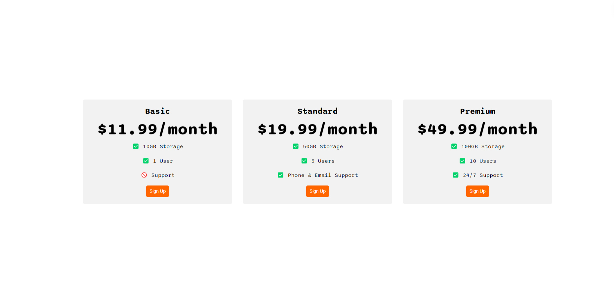

# Flexbox Pricing Table

## Overview

The Flexbox Pricing Table is a web-based application designed to present various subscription plans in a visually appealing and responsive layout. Utilizing the CSS Flexbox model, this project demonstrates how to create a structured and adaptable pricing table that adjusts seamlessly across different screen sizes.

## Objectives

The primary objectives of this project are:

- To showcase different pricing tiers with associated features.
- To provide an intuitive user interface that encourages engagement through a clear call-to-action.
- To leverage modern web technologies for responsive design.

## Theoretical Background

### CSS Flexbox

Flexbox, or the Flexible Box Layout, is a one-dimensional layout method for arranging items in a container. It allows for efficient alignment, spacing, and distribution of space among items, even when their size is unknown or dynamic. Key properties include:

- **`display: flex;`**: Activates Flexbox on the container.
- **`flex-direction`**: Defines the direction items are placed in the flex container (row or column).
- **`justify-content`**: Aligns items along the main axis.
- **`align-items`**: Aligns items along the cross axis.

### Responsive Design

Responsive design is an approach that ensures web applications function well on a variety of devices and window or screen sizes. It involves using fluid grids, flexible images, and media queries to adapt the layout to the viewing environment.

### User Experience (UX)

A well-designed pricing table enhances user experience by:

- Clearly presenting information.
- Guiding users towards making informed decisions.
- Encouraging actions through visible buttons.

## Features

- **Three Pricing Plans**: Each plan (Basic, Standard, Premium) includes a title, price, features, and a call-to-action button.
- **Responsive Layout**: The table adjusts to different screen sizes using Flexbox, ensuring usability on both desktop and mobile devices.
- **Semantic HTML**: Utilizes HTML5 elements for better accessibility and SEO.

## Implementation

The implementation involves:

1. **HTML Structure**: A semantic layout that organizes the pricing plans within a container.
2. **CSS Styling**: Styles that define the appearance of the table, including colors, typography, and layout properties using Flexbox.
3. **Media Queries**: CSS rules that adapt the layout for smaller screens.

## Conclusion

The Flexbox Pricing Table serves as a practical example of combining modern web design techniques to create an effective user interface. By leveraging CSS Flexbox for layout and responsive design principles, this project highlights the importance of user-centered design in web applications.

## Future Enhancements

Potential improvements could include:

- Adding animations or transitions for button interactions.
- Implementing JavaScript for dynamic features, such as form submissions or user feedback.
- Expanding the pricing plans with additional options or features.

## License

This project is licensed under the MIT License. For more details, please refer to the LICENSE file.
